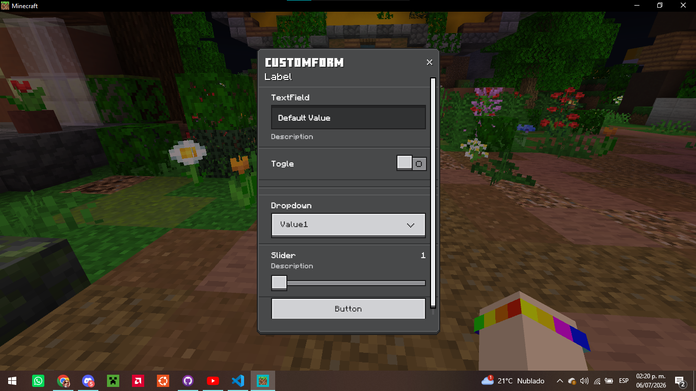
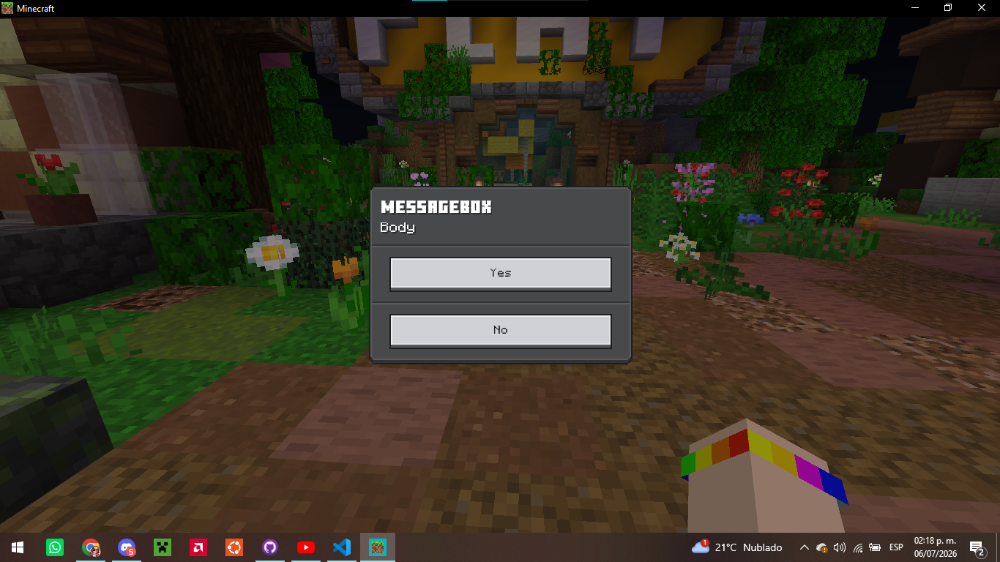

# Data-Driven UI
A PocketMine-MP library to create and manage Data-Driven UIs!
> [!WARNING]
> This library is a beta version and does not implement all the available features of the vanilla Data-Driven UI.

> [!NOTE]
> You must register `DataDrivenUIHandler` before you can use DDUI.
> ```php
> // in class MyPlugin extends PluginBase:
> protected function onEnable() : void{
> 	if(!DataDrivenUIHandler::isRegistered()){
> 		DataDrivenUIHandler::register($this);
> 	}
> }

## Create a DDUI
Quick start, use `CustomForm::create('Title')->send($player);` to display a DDUI

`Type::create(params)` creates a UI instance. Available types are [CustomForm](https://github.com/Joshet18/Data-DrivenUI/edit/main/README.md#customform) and [MessageBox](https://github.com/Joshet18/Data-DrivenUI/edit/main/README.md#messagebox).

## CustomForm
> available methods:
> 
> `label(string $text): CustomForm`
> 
> `spacer(): CustomForm`
> 
> `textField(string $label, string $default, Closure(string) $onChange, string $description = ""): CustomForm`
> 
> `toggle(string $label, bool $default, Closure(bool) $onToggle): CustomForm`
> 
> `divider(): self`
>
> `dropdown(string $label, array $options, int $defaultIndex, Closure(int) $onSelect): CustomForm`
>
> `slider(string $label, float $default, float $min, float $max, float $step, Closure(int) $onChange, string $description = ""): CustomForm`
>
> `button(string $label, Closure(void) $onClick, bool $closeOnClick = true): CustomForm`
> 
> Example:
> ```php
> $ui = CustomForm::create('CustomForm');
> $ui->label("Label");
> $ui->spacer();
> $ui->textField('TextField', 'Default Value', $nf, 'Description');
> $ui->toggle('Togle', false, $nf);
> $ui->divider();
> $ui->dropdown('Dropdown', ['Value1', 'Value2'], 0, $nf);
> $ui->slider('Slider', 1, 1, 64, 1, $nf, 'Description');
> $ui->button('Button', $nf, true);
> $ui->send($sender);
> ```
> Result:
> 

## MessageBox
> available methods:
>
> `button1(string $label, ?string $tooltip = null): MessageBox`
>
> `button2(string $label, ?string $tooltip = null): MessageBox`
>
> `whenClosed(Closure(int) $handler): MessageBox`
> 
> Example:
> ```php
> $ui = MessageBox::create('MessageBox', 'Body');
> $ui->button1('Yes'); //returns 1 when chosen
> $ui->button2('No'); //returns 2 when chosen
> $ui->whenClosed(function ($value) use ($sender) {
>   $sender->sendMessage('Selection: ' . $value);
> });
> $ui->send($sender);
> ```
> Result:
> 